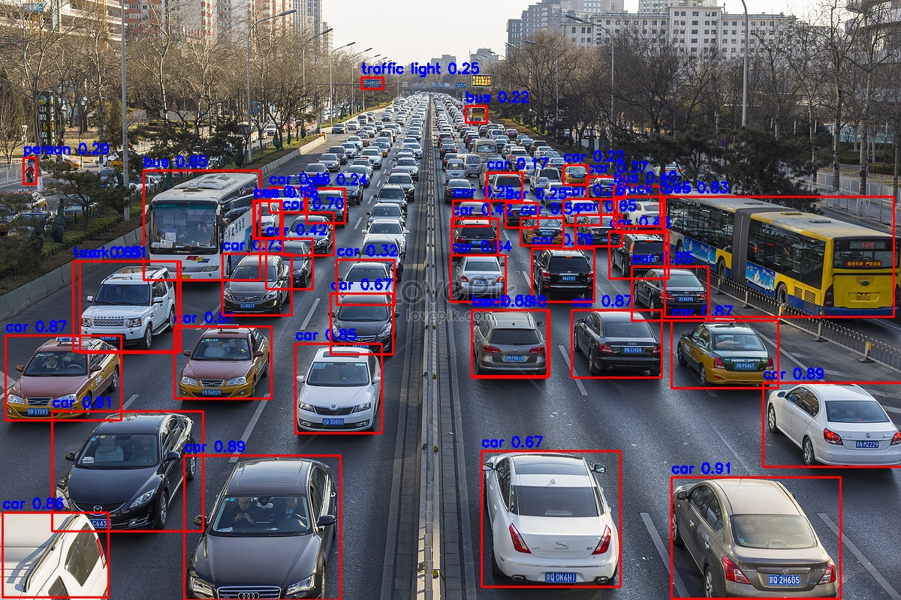
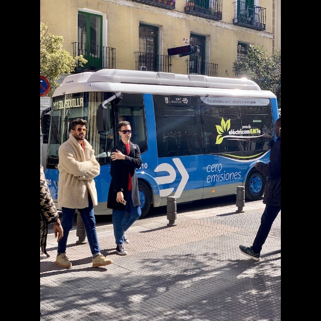
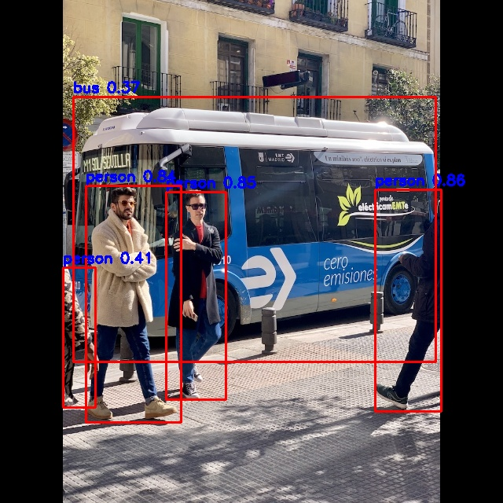

## YOLO on Rockchip

* In here, the humble aim is to provide an easier way to convert, and run yolo family models on rockchip devices.
* I believe that many rockchip users out there are frustrated (including me) when developing ML/AI models on these devices.
* Hence, my short term goal might be to help me, and everyone who're interested on deeplearning inference on these devices to enjoy easier developing processes.
* FYI, The yolo postprocess code are derived heavily from rknn-toolkit2, simplified, and unified for user-friendly inference.
* Also FYI, the latest rknn-toolkit2 (2.1.0) could work with newer yolo family (yolov5, v8, v10 etc). with less/no changes to the original onnx models, hence giving us a "simpler" converting experience.

## Supported YOLO MODELS

- [x] yolov5.
- [x] yolov8.
- [x] yolov10.
- [ ] yolox.

---

### How To Use

1. Install rknn-toolkit-lite following official repo.
2. Convert the model, you can use yolo*/convert_yolo*.py for reference.
```
YOLOV5 -> yolov5/convert_yolov5.py
YOLOV8 -> yolov8/convert_yolov8.py
YOLOV10 -> yolov10/convert_yolov10.py # trim the model until output 1x84x8400 / yolov8 onnx output
```
3. Do Inference:
  * YOLOV5 
  ```
  python3 image_runner.py --modelpath models/yolov5su.rknn --model_type yolov5 -s 0.1
  ```
  * YOLOV8
  ```
  python3 image_runner.py --modelpath models/yolov8n.rknn --model_type yolov8 -s 0.1
  ```
  * YOLOV10
  ```
  python3 image_runner.py --modelpath models/yolov10n_mod2.rknn --model_type yolov10 -s 0.1
  ```

## Demo and Screenshot Results

https://github.com/briliantnugraha/Deeplearning_rk3588/assets/9381132/94ac511d-03b3-4b27-a822-c9326a096a36


|Original|Detection|
|---|---|
|  |  |
| |  |  |

---

## Acknowledgements

- https://github.com/Applied-Deep-Learning-Lab/Yolov5_RK3588
- [rknn_toolkit2](https://github.com/airockchip/rknn-toolkit2/)
- [YOLOV5](https://github.com/ultralytics)
- [YOLOV8](https://github.com/ultralytics)
- [YOLOV10](https://github.com/THU-MIG/yolov10)
